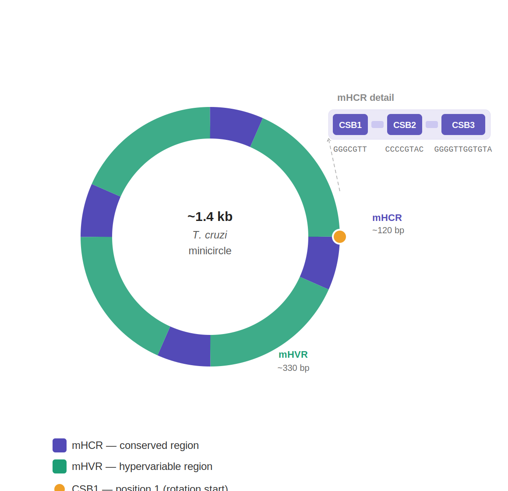

# kDNA-Minicircle-analysis

Python scripts for the detection, orientation and rotation of kinetoplast minicircles from Oxford Nanopore Technology (ONT) sequencing reads, using CSB motifs and BLAST.

## Example output



## Description

Kinetoplast minicircles (~1.4 kb) contain four conserved regions (mHCR, ~120 bp each) alternating with four hypervariable regions (mHVR, ~330 bp each). Each mHCR contains three conserved sequence blocks: CSB1 (`GGGCGTT`), CSB2 (`CCCCGTAC`) and CSB3 (`GGGGTTGGTGTA`).

This repository provides two scripts that implement the same core pipeline with different approaches for read orientation:

### Pipeline overview

1. Convert FASTQ to FASTA
2. BLAST reads against CSB motifs to identify minicircle candidates
3. Filter candidates by length (1300–1600 bp)
4. Orient reads based on CSB1 strand
5. Filter reads with exactly 4 CSB1 copies
6. Rotate each sequence to start at CSB1 (position 1)

### Scripts

| Script | Orientation method |
|--------|-------------------|
| `minicircle_analysis_majority_orientation.py` | Orients reads by counting CSB1 copies on each strand — the strand with more copies defines the orientation. Reads with equal counts on both strands are discarded. |
| `minicircle_analysis_seqkit_orientation.py` | Orients reads using `seqkit locate` to detect CSB1 on each strand. Reads where CSB1 is found on both strands are discarded as ambiguous. |

## Requirements

- Python 3.7 or higher
- BLAST+ (installed automatically if not found)
- seqkit (installed automatically — seqkit orientation script only)

## Input files

A FASTQ or FASTA file containing ONT sequencing reads. Compressed files (`.gz`) are supported.

## Usage

### On your local machine

```bash
python minicircle_analysis_majority_orientation.py
```

or

```bash
python minicircle_analysis_seqkit_orientation.py
```

The script will ask you to enter the filename of your input file:

```
Enter the name of your input file (e.g. sample.fastq.gz): your_reads.fastq.gz
```

### On Google Colab

Upload the script and run it. All required tools are installed automatically.

## Output files

Results are saved in `minicircle_results/` (majority script) or `minicircle_results_seqkit/` (seqkit script):

| File | Description |
|------|-------------|
| `reads_all.fasta` | All input reads converted to FASTA |
| `reads_with_CSB.fasta` | Reads with at least one CSB hit |
| `Mini1300-1600.fasta` | Candidates filtered by length |
| `Minis4CSB.fasta` | Minicircles with exactly 4 CSB1 copies (unrotated) |
| `Minis4CSB_start.fasta` | Final minicircles rotated to start at CSB1 |

## Parameters

All parameters can be adjusted at the top of each script:

| Parameter | Description | Default |
|-----------|-------------|---------|
| `CSB1` | CSB1 motif sequence | `GGGCGTT` |
| `CSB2` | CSB2 motif sequence | `CCCCGTAC` |
| `CSB3` | CSB3 motif sequence | `GGGGTTGGTGTA` |
| `MIN_LEN` | Minimum minicircle length (bp) | 1300 |
| `MAX_LEN` | Maximum minicircle length (bp) | 1600 |
| `EXPECTED_CSB1` | Expected number of CSB1 copies | 4 |

## License

This work is licensed under a [Creative Commons Attribution-NonCommercial 4.0 International License](https://creativecommons.org/licenses/by-nc/4.0/).

You are free to use and adapt these scripts for non-commercial purposes, as long as appropriate credit is given.

## Author

Fanny Rusman — IPE-CONICET, Salta, Argentina  
[](https://orcid.org/0000-0003-3995-9027)
